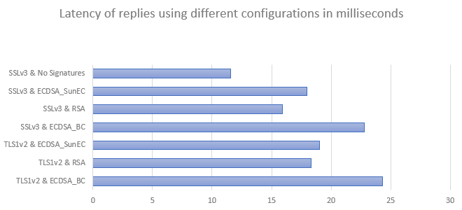

# CSD Project

Proof of Work blockchain based on ECDSA (Bouncy Castle) public-key cryptography. To get coins in the start it is needed to mine blocks to get the reward and that can be done using the miner client or the regular client with the 'mineBlock' command. After that, coins can be spent to other addresses if we provided a valid ECDSA public key and we have the private key to spend the coins. Funds sent to invalid addresses are lost forever because they can't be spent. Consensus rules can be changed on the ConsensusRules.java class.

## Installation guide

1º - Clone repository

2º -Install bft-smart library that is in bin folder
``` java
cd CSD-Blockchain
mvn install:install-file -Dfile=./bin/BFT-SMaRt.jar -DgroupId=bft-smart -DartifactId=library -Dversion=1.2 -Dpackaging=jar
```

3º - Compile maven project
``` java
mvn compile
``` 

3º - Launch servers
``` java
mvn exec:java -Dexec.mainClass=server.RESTServer -Dexec.args="0 1000 8080"
mvn exec:java -Dexec.mainClass=server.RESTServer -Dexec.args="1 1001 8081"
mvn exec:java -Dexec.mainClass=server.RESTServer -Dexec.args="2 1002 8082"
mvn exec:java -Dexec.mainClass=server.RESTServer -Dexec.args="3 1003 8083"
``` 

4º - Launch client to make requests
``` java
mvn exec:java -Dexec.mainClass=client.Client
```

Optional - Launch miner client that is always trying to mine blocks (blocks can also be mined with the regular client using the 'mineBlock' command)
``` java
mvn exec:java -Dexec.mainClass=client.Miner
```

## Testing results
Data of the tests is in the latency_test_data.xlsx file, every test was run 50 times, and the result is the average.
<br /> <br /> 

